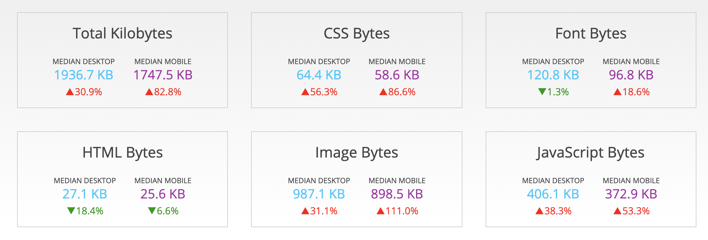
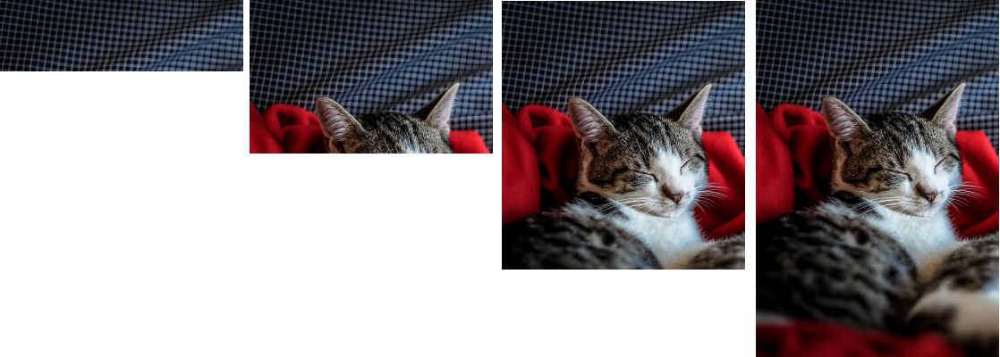
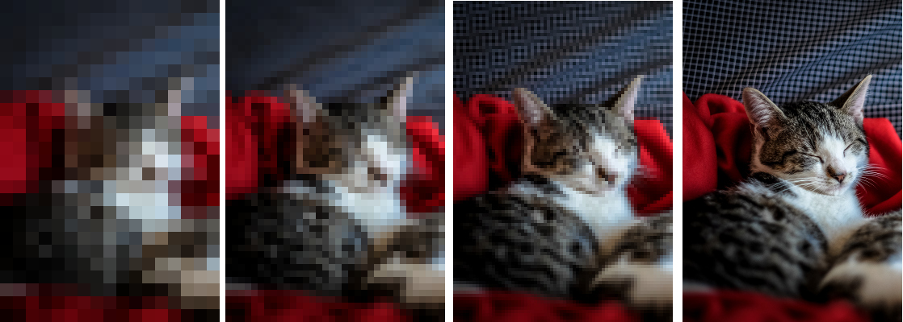

# 图片

[🔝 页面静态资源](./README.md) | [🔙 上一站 - CSS](../5-subresources/css.md)

优质的图片可以有效吸引用户，给用户良好的体验，所以随着互联网的发展，越来越多的产品开始使用图片来提升产品体验。而相较于页面其他元素，图片的体积不容忽视。对于很多网站应用来说，图片所占的流量可能会超过 50%。下图是截止 2019 年 6 月 [HTTP Archive](https://httparchive.org/reports/page-weight?view=grid)<sup>[1]</sup> 上统计的网站上各类资源加载的体积：



可以看到，图片占据了半壁江山。同样，在这篇 2018 年的[文章](https://dougsillars.com/2018/05/21/state-of-the-web-top-image-optimization-strategies/?utm_source=mybridge&utm_medium=blog&utm_campaign=read_more)<sup>[2]</sup>中，也提到了图片在网站中体量的平均占比已经超过了 50%。并且随着平均加载图片总字节数的增加，图片的请求数却再减少，这也从一定程度上说明网站使用的图片质量和大小正在提高。

所以，如果单纯从加载的字节数这个维度来看性能优化，那么很多时候，优化图片带来的流量收益要远高于优化 JavaScript 脚本和 CSS 样式文件。那么下面我们就来看看，如何优化图片资源。

## 1. 优化请求

### 1.1. 雪碧图

图片可以合并么？当然。

最为常用的图片合并场景就是[雪碧图（Sprite）](https://css-tricks.com/css-sprites/)<sup>[3]</sup>。在网站上通常会有很多小的图标，最直接的使用方式就是将这些小图标保存为一个个独立的图片文件，然后通过 CSS 将对应元素的背景图片设置为对应的图标图片。然而，这里有一个重要的问题：页面加载时可能会同时请求非常多的小图标图片，这就会收到浏览器并发 HTTP 请求数的限制。我见过一个没有使用雪碧图的页面，首页加载时需要发送多达 15 个请求来加载图标。将图标合并为一张大图可以实现 15 -> 1 的巨大缩减。

雪碧图主要就是依赖设置不同的背景偏移量工作的，大致包含两点：

- 不同的图标元素都会将 `background-url` 设置为合并后的雪碧图 URI；
- 不同的图标通过设置对应的 `background-position` 来展示大图中对应的图标部分。

你可以用 Photoshop 这类工具自己生成雪碧图。当然比较推荐的还是将雪碧图的自动生成集成到前端构建工具中，例如在 Webpack 中使用 [webpack-spritesmith](https://github.com/mixtur/webpack-spritesmith)，或者在 gulp 中使用 [gulp.spritesmith](https://github.com/twolfson/gulp.spritesmith)。两者都依赖于 [spritesmith](https://github.com/twolfson/spritesmith) 这个库，你也可以自己将这个库集成到你喜欢的构建工具中。

### 1.2. 懒加载

我们知道，一般来说我们访问一个页面，浏览器加载的整个页面其实是要比可视区域大很多的，也就是“首屏”的概念。这就导致其实很多图片是不在首屏中的，如果我们都加载的话，相当于是加载了用户不一定会看到图片，而图片体积一般都不小，这显然是一种流量的浪费。这种场景在一些带图片的长列表或者配图的博客中非常常见。

解决的核心思路就是图片懒加载 —— 尽量只加载用户正在浏览或者即将会浏览到的图片。实现上来说最简单的就是通过监听页面滚动，判断图片是否进入视野，从而真正去加载图片：

```JavaScript
function loadIfNeeded($img) {
    const bounding = $img..getBoundingClientRect();
    if (
        getComputedStyle($img).display !== 'none'
        && bounding.top <= window.innerHeight
        && bounding.bottom >= 0
    ) {
        $img.src = $img.dataset.src;
        $img.classList.remove('lazy');
    }
}

// 这里使用了 throttle，你可以实现自己的 throttle，也可以使用 lodash
const lazy = throttle(function () {
    const $imgList = document.querySelectorAll('.lazy');
    if ($imgList.length === 0) {
        document.removeEventListener('scroll', lazy);
        window.removeEventListener('resize', lazy);
        window.removeEventListener('orientationchange', lazy);
        return;
    }
    $imgList.forEach(loadIfNeeded);
}, 200);

document.addEventListener('scroll', lazy);
window.addEventListener('resize', lazy);
window.addEventListener('orientationchange', lazy);
```

对于页面上的元素只需要将原本的 `src` 值设置到 `data-src` 中即可，而 `src` 可以设置为一个统一的占位图。注意，由于页面滚动、缩放和横竖方向（移动端）都可能会改变可视区域，因此添加了三个监听。

当然，这是最传统的方法，现代浏览器还提供了一个更先进的 [Intersection Observer API](https://developers.google.com/web/updates/2016/04/intersectionobserver)<sup>[4]</sup> 来做这个事，它可以通过更高效的方式来监听元素是否进入视口。考虑兼容性问题，可以在生产环境中使用对应的 [polyfill](https://github.com/w3c/IntersectionObserver/tree/master/polyfill)。

如果想使用懒加载，可以借助一些已有的工具库，例如 [aFarkas/lazysizes](https://github.com/aFarkas/lazysizes)、[verlok/lazyload](https://github.com/verlok/lazyload)、[tuupola/lazyload](https://github.com/tuupola/lazyload) 等。

在使用懒加载时也有一些注意点：

- 首屏可以不需要懒加载，对首屏图片也使用懒加载会延迟图片的展示。
- 设置合理的占位图，避免图片加载后的页面“抖动”。
- 虽然目前基本所有用户都不会禁用 JavaScript，但还是建议做一些 JavaScript 不可用时的 backup。

对于占位图这块可以再补充一点。为了更好的用户体验，我们可以使用一个基于原图生成的体积小、清晰度极低的图片作为占位，这样一来不会增加太大的体积，二来会有很好的用户体验。[LQIP](https://www.guypo.com/introducing-lqip-low-quality-image-placeholders)<sup>[5]</sup> 就是这种技术。目前也已经有了 [LQIP](https://github.com/zouhir/lqip) 和 [SQIP(SVG-based LQIP)](https://github.com/axe312ger/sqip) 的自动化工具可以直接使用。

如果你想了解更多关于图片懒加载的内容，可以[看这里](https://css-tricks.com/the-complete-guide-to-lazy-loading-images/)<sup>[6]</sup>。

### 1.3. CSS 中的图片懒加载

除了对于 `img` 元素的图片进行来加载，在 CSS 中使用的图片一样可以懒加载，最常见的场景就是 `background-url`。

```CSS
.login {
    background-url: url(/static/img/login.png);
}
```

对于上面这个样式规则，如果不应用到具体的元素，浏览器不会去下载该图片。所以你可以通过切换 className 的方式，放心得进行 CSS 中图片的懒加载。

### 1.4. 内联 base64

还有一种方式是将图片转为 base64 字符串，并将其内联到页面中返回。这样，当浏览器解析到对一个的图片 URL 时，就不要请求并下载图片，直接解析 base64 字符串即可。

但是这种方式的一个缺点在于相同的文件，相比使用二进制，变成 base64 后体积会增大 33%。而全部内联进页面后，也意味着原本可能并行加载的图片信息，都会在页面请求中串行加载。同时也不利于复用文件缓存。所以，使用 base64 需要权衡，常用于加载首屏时展示一些小图标。

## 2. 减小图片大小

### 2.1. 使用合适的图片格式

使用合适的图片格式不仅能帮助你减少不必要的请求流量，同时还可能提供更好的图片体验。

图片格式是一个比较大的话题，[选择合适的格式](https://www.sitepoint.com/what-is-the-right-image-format-for-your-website/)<sup>[7]</sup>有利于性能优化。这里我们简单总结一些。

**1) 使用 WebP：**

考虑[在网站上使用 WebP 格式](https://css-tricks.com/using-webp-images/)<sup>[8]</sup>。在有损与无损压缩上，它的表现都会优于传统（JPEG/PNG）格式。WebP 无损压缩比 PNG 的体积小 26%，webP 的有损压缩比同质量的 JPEG 格式体积小 25-34%。同时 WebP 也支持透明度。下面提供了一种兼容性更好的写法。

```HTML
<picture>
    <source type="image/webp" srcset="/static/img/perf.webp">
    <source type="image/jpeg" srcset="/static/img/perf.jpg">
    
</picture>
```

**2) 使用 SVG 应对矢量图场景：**

在一些需要缩放，或者用作图标的场景下使用 SVG 这种矢量图非常不错。

**3) 使用 video 替代 GIF：**

在[兼容性允许](https://caniuse.com/#feat=video)的情况下考虑，可以在想要动图效果时使用视频，即使用静音（muted）的 video 来代替 GIF。相同的效果下，[GIF 比视频（MPEG-4）大 5～20 倍](https://youtu.be/reztLS3vomE?t=158)。[Smashing Magazine 上有篇文章](https://www.smashingmagazine.com/2018/11/gif-to-video/)<sup>[9]</sup>详细介绍使用方式。

**4) 渐进式 JPEG：**

基线 JPEG (baseline JPEG) 会从上往下逐步呈现，类似下面这种：



而另一种[渐进式 JPEG (progressive JPEG)](https://www.zhangxinxu.com/wordpress/2013/01/progressive-jpeg-image-and-so-on/)<sup>[10]</sup> 则会从模糊到逐渐清晰，更人的感受上会更加平滑。



不过渐进式 JPEG 的解码速度会慢于基线 JPEG，所以还是需要综合考虑 CPU、网络等情况，在实际的用户体验之上做权衡。

### 2.2. 图片质量的权衡

图片的压缩一般可以分为有损压缩（lossy compression）和无损压缩（lossless compression）。顾名思义，有损压缩下，会损失一定的图片质量，无损压缩则能够在保证图片质量的前提下压缩数据大小。不过，无损压缩一般可以带来更客观的体积缩减。在使用有损压缩时，一般我们可以指定一个 0-100 的压缩质量。在大多数情况下，相较于 100 质量系数的压缩，80～85 的质量系数可以带来 30～40% 的大小缩减，同时对图片效果影响较小，即人眼不易分辨出质量效果的差异。


处理图片压缩可以使用 [imagemin](https://github.com/imagemin/imagemin) 这样的工具，也可以进一步将它集成至 [Webpack](https://github.com/tcoopman/image-webpack-loader)、[Gulp](https://github.com/sindresorhus/gulp-imagemin)、[Grunt](https://github.com/gruntjs/grunt-contrib-imagemin) 这样的自动化工具中。

### 2.3. 使用合适的大小和分辨率

由于移动端的发展，屏幕尺寸更加多样化了。同一套设计在不同尺寸、像素比的屏幕上可能需要不同像素大小的图片来保证良好的展示效果；此外，响应式设计也会对不同屏幕上最佳的图片尺寸有不同的要求。

以往我们可能会在 1280px 宽度的屏幕上和 640px 宽度的屏幕上都使用一张 400px 的图，但很可能在 640px 上我们只需要 200px 大小的图片。另一方面，如今所谓的“2 倍屏”、“3 倍屏”盛行，更使得在低分辩率屏幕上加载“大图”造成了很大的浪费。

好在 HTML5 为在 `img` 元素上我们提供了 [`srcset`](https://developer.mozilla.org/en-US/docs/Web/HTML/Element/img#attr-srcset) 和 [`sizes`](https://developer.mozilla.org/en-US/docs/Web/HTML/Element/img#attr-sizes) 属性，可以让浏览器根据屏幕信息来选择需要展示的图片。

```HTML

```

具体的使用方式可以看[这篇文章](https://www.zhangxinxu.com/wordpress/2014/10/responsive-images-srcset-size-w-descriptor/)<sup>[11]</sup>。

### 2.4. 删除冗余的图片信息

你也许不知道，很多图片含有一些非“视觉化”的元信息（metadata），带上它们可会[导致体积增大与安全风险](https://www.keycdn.com/blog/image-metadata)<sup>[12]</sup>。元信息包括图片的 DPI、相机品牌、拍摄时的 GPS 等，可能导致 JPEG 图片大小增加 15%。同时，其中的一些隐私信息也可能会带来安全风险。

所以如果不需要的情况下，可以使用像 [imageOptim](https://imageoptim.com/versions) 这样的工具来移除隐私与非关键的元信息。

### 2.5 SVG 压缩

在 2.1. 中提到，合适的场景下可以使用 SVG。然而很多人可能不知道，针对 SVG 我们也可以进行一些压缩。压缩包括了两个方面：

首先，与图片不同，图片是二进制形式的文件，而 SVG 作为一种 XML 文本，同样是适合使用 gzip 压缩的。

其次，SVG 本身的信息、数据是可以压缩的，例如用相比用 path 画一个椭圆，直接使用 ellipse 可以节省文本长度。关于信息的“压缩”还有[更多可以优化的点](https://css-tricks.com/understanding-and-manually-improving-svg-optimization/)<sup>[13]</sup>。[SVGGO](https://github.com/svg/svgo) 是一个可以集成到我们构建流中的 NodeJS 工具，它能帮助我们进行 SVG 的优化。当然你也可以使用它提供的 [Web 服务](https://jakearchibald.github.io/svgomg/)。

## 3. 缓存

与其他静态资源类似，我们仍然可以使用[各类缓存策略](../1-cache/README.md)来加速资源的加载。

---

图片作为现代 Web 应用的重要部分，在资源占用上同样也不可忽视。可以发现，在上面提及的各类优化措施中，同时附带了相应的工具或类库。平时我们主要的精力会放在 CSS 与 JavaScript 的优化上，因此在图片优化上可能概念较为薄弱，自动化程度较低。如果你希望更好得去贯彻图片的相关优化，非常建议将自动化工具引入到构建流程中。

除了上述的一些工具，这里再介绍两个非常好用的图片处理的自动化工具：[Sharp](https://github.com/lovell/sharp) 和 [Jimp](https://github.com/oliver-moran/jimp)。

好了，我们的图片优化之旅就暂时到这了，下面就是字体资源了。

[下一站 - 字体 🔜](./font.md)

---

## 参考资料

1. [HTTP Archive: Page Weight Report](https://httparchive.org/reports/page-weight?view=grid)
1. [State of the Web: Top Image Optimization Strategies](https://dougsillars.com/2018/05/21/state-of-the-web-top-image-optimization-strategies/)
1. [CSS Sprites: What They Are, Why They’re Cool, and How To Use Them](https://css-tricks.com/css-sprites/)
1. [IntersectionObserver’s Coming into View](https://developers.google.com/web/updates/2016/04/intersectionobserver)
1. [Introducing LQIP – Low Quality Image Placeholders](https://www.guypo.com/introducing-lqip-low-quality-image-placeholders)
1. [The Complete Guide to Lazy Loading Images](https://css-tricks.com/the-complete-guide-to-lazy-loading-images/)
1. [What Is the Right Image Format for Your Website?](https://www.sitepoint.com/what-is-the-right-image-format-for-your-website/)
1. [Using WebP Images](https://css-tricks.com/using-webp-images/)
1. [Improve Animated GIF Performance With HTML5 Video](https://www.smashingmagazine.com/2018/11/gif-to-video/)
1. [渐进式jpeg(progressive jpeg)图片及其相关](https://www.zhangxinxu.com/wordpress/2013/01/progressive-jpeg-image-and-so-on/)
1. [响应式图片srcset全新释义sizes属性w描述符](https://www.zhangxinxu.com/wordpress/2014/10/responsive-images-srcset-size-w-descriptor/)
1. [An Overview of Image Metadata - How It Affects Web Performance and Security](https://www.keycdn.com/blog/image-metadata)
1. [Understanding and Manually Improving SVG Optimization](https://css-tricks.com/understanding-and-manually-improving-svg-optimization/)
1. [Essential Image Optimization Guide](https://images.guide/)
1. [见微知著，Google Photos Web UI 完善之旅](https://zhuanlan.zhihu.com/p/50280008)
1. [Automating image optimization](https://developers.google.com/web/fundamentals/performance/optimizing-content-efficiency/automating-image-optimization/)
1. [Lazy loading images using Intersection Observer](http://deanhume.com/lazy-loading-images-using-intersection-observer/)
1. [Trust is Good, Observation is Better—Intersection Observer v2](https://developers.google.com/web/updates/2019/02/intersectionobserver-v2)
1. [Image policies for fast load times and more](https://web.dev/image-policies/)