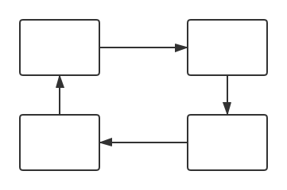

# 尾声

我们这次的「性能优化之旅」已经到了尾声，还记得我们这次旅程的初衷么 —— 从整个前端访问链条的角度，来理解与掌握前端性能优化的知识和技术。

> 如果有些内容忘记了的话，可以点击下面的列表再复习一下。

旅途站点列表

- [第一站 - 缓存](./1-cache/README.md)
- [第二站 - 发送请求](./2-request/README.md)
- [第三站 - 服务端处理](./3-response/README.md)
- [第四站 - 下载与解析页面](./4-parse/README.md)
- [第五站 - 页面静态资源](./5-subresources/README.md)
  - [JavaScript](./5-subresources/javascript.md)
  - [CSS](./5-subresources/css.md)
  - [图片](./5-subresources/image.md)
  - [字体](./5-subresources/font.md)
  - [视频](./5-subresources/video.md)
- [第六站 - 运行时](./6-runtime/README.md)
- [第七站 - 预加载](./7-preload/README.md)
- [尾声](./END.md)

最后，再和大家随意聊一聊性能优化实践相关的话题。

## 性能指标 ⏱

Web 发展到现今阶段，性能指标已经不再只是 `DOMContentLoad` 和 `load` 这样的“面向浏览器”的指标，更多的会是以用户为中心（user-centric）的指标，例如：

- FP (First Paint)
- FID (First Input Delay)
- FCP (First Contentful Paint)
- FMP (First Meaningful Paint)
- TTI (Time to interactive)
- ……

所以在性能优化之前最重要的还是明确你的监控指标和分析维度，关于性能指标其实也是一个可以继续聊下去的内容，这里就不展开了，之后有机会会把这部分补充进来。

## 持续优化 📈

性能优化很多时候不是一蹴而就的，更不是一锤子买卖。一个良好的性能优化方案一定是一个持续循环的体系。

通过线上的性能监控数据，或者前端自动化性能测试分析，发现性能问题，针对发现的问题进行分析与定位，然后进行针对性优化，最后上线观察，之后又会进入到下一个性能优化循环中。所以推行性能优化，一定要注重优化工程的可持续性。

## 监控与测试 💻

其实性能监控与测试也是一块非常大的话题，包括监控的手段、分析的维度等等，如果后续有机会希望把这块再补充上来。这里先介绍介绍一下。

我们一般会[把性能数据分为两种](https://developers.google.com/web/fundamentals/performance/speed-tools/)[1]：

- 一种叫 Lab data，主要是在开发和测试人员本地或内部测试机器上跑出来的数据，例如在 CI/CD 中加入 [lighthouse](https://github.com/GoogleChrome/lighthouse)。它的有点在与采集的指标更全面，也易于复现问题；缺点主要在于有时候可能不能反应真实的用户体验情况。
- 另一种叫 Field data，也被成为 RUM (Real User Monitoring)，是指采集线上实际的性能数据来进行监控。它的优点则是能够帮助更好地发现用户实际遇到的性能问题；缺点主要是比较难以调试与复现遇到的问题，同时能够采集到的指标的详细程度肯定不及 Lab data。

而 [The Three Types of Performance Testing](https://csswizardry.com/2018/10/three-types-of-performance-testing/)[2] 则进一步划分出了三类性能测试。

- 第一种叫做 Proactive：它可以理解为是工程师在开发阶段，通过浏览器调试等本地工具来发现并解决性能问题（善于利用 [Chrome DevTools](https://developers.google.com/web/tools/chrome-devtools/)[3] 也是一个优秀前端工程师所需要具备的 😊）；
- 第二种叫做 Reactive：它是一种自动化的性能测试，可以集成到自动化测试或流水线的其他阶段，会在构建与每次发布前执行；
- 第三种叫做 Passive：它就是在产品发布后，通过收集线上数据（或者用户反馈）来发现性能问题，主要是基于一些 RUM。

选择哪种性能测试呢？答案是将它们结合使用（就像是自动化测试种会包括单元测试、集成测试、端到端测试）。

对于一些易于标准化的性能标准，可以考虑使用 Proactive/Reactive 这样的 Lab data 来避免性能问题，而对于更复杂的业务场景，则通过 Passive 模式下的 Field data 进行监控。

## 自动化 🛠

务必将可以自动化的性能优化工作都自动化。

前端性能优化的链路包括了「缓存 -> 发送请求 -> 等待响应 -> 解析 -> 处理各类静态资源 -> 运行时 -> 预加载（等待后续的请求）」，还是比较复杂的。因此，建议通过一些工具来将工作自动化。

在旅程中各个技术点处，我也都会提到一些用来帮助快速实现优化措施或自动化的工具，例如基于 Workbox 中提供的各类成熟的缓存方案、图片压缩的工具、Webpack 插件等等。还包括上面提到的，可以在 CI/CD 中集成的 [lighthouse](https://github.com/GoogleChrome/lighthouse)[4] 这样的分析工具。而对于 RUM，如果你们公司有人力可以自建一套体系，如果自建成本较高，可以考虑接入一些免费或收费的商业公司产品。

## 感谢 💛

在「性能优化之旅」的尾声还是要表示感谢。

在“旅程”中我参考了很多技术资料或文章，感谢这些作者和网站的在前端性能优化方面的工作。

其次，文章内容主要是我结合这些性能优化的资料和实践总结而成，其中难免会有错漏，所以欢迎大家在这方面进行斧正。

最后，很感谢各位朋友能够读完这些内容，你们的支持也是我写作的动力。也希望文中的内容对大家日后的技术工作会有帮助。

[🔚 回到首页 🎊](./README.md)

---

## 参考资料

1. [How To Think About Speed Tools](https://developers.google.com/web/fundamentals/performance/speed-tools/)
1. [The Three Types of Performance Testing](https://csswizardry.com/2018/10/three-types-of-performance-testing/)
1. [Get Started With Analyzing Runtime Performance (Chrome DevTools)](https://developers.google.com/web/tools/chrome-devtools/evaluate-performance/)
1. [Lighthouse](https://developers.google.com/web/tools/lighthouse/)
1. [User Timing and Custom Metrics](https://speedcurve.com/blog/user-timing-and-custom-metrics/)
1. [Instant Loading Web Apps with an Application Shell Architecture](https://developers.google.com/web/updates/2015/11/app-shell)
1. [The PRPL Pattern](https://developers.google.com/web/fundamentals/performance/prpl-pattern/)
1. [构建时预渲染：网页首帧优化实践](https://tech.meituan.com/2018/11/15/first-contentful-paint-practice.html)
1. [Measure Performance with the RAIL Model](https://developers.google.com/web/fundamentals/performance/rail#goals-and-guidelines)

---

除注明外，本仓库内文章均采用 [Creative Commons BY-NC-ND 4.0](https://creativecommons.org/licenses/by-nc-nd/4.0/deed.zh) 协议。

